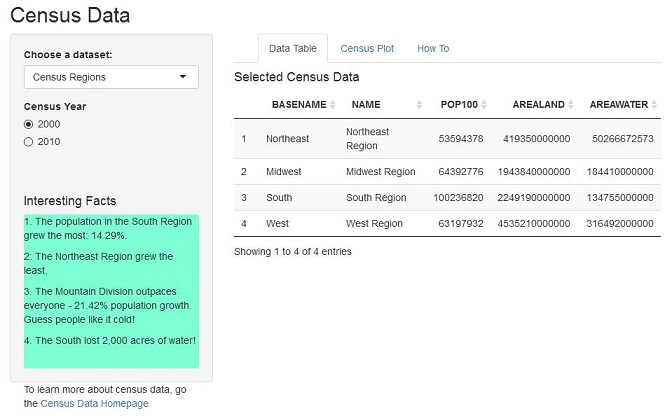
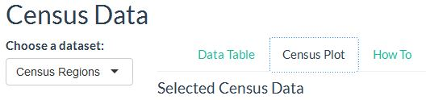
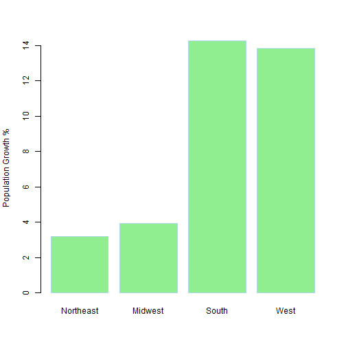

U.S. Census Population Changes: 2000 & 2010
========================================================
author: Cliff Weaver
date: Jan 23, 2016
transition: concave

Introduction
========================================================
type: prompt

To satisfy the requirements of the Coursera *Developing Data Products* Course, the 9th course in the JHU Data Science Specialization Certification, an interactive Shiny application was built.

The [Shiny application](https://zellw.shinyapps.io/shiny2/) compares the population and land/water area using data from the 2000 and 2010 U.S. Census.

This presentation introduces you to the application and how it works.

What to Expect
========================================================
type: prompt

The default view shows the population of the 4 U.S. Regions for the 2000 Census

- The user can select a different dataset (Regions or Divisions) and choose between the 2000 and 2010 Census year.

- Any change the user makes will be immediately reflected.

- The default view presents a table.

***

Census Plots
===
type: prompt

Using the tabbbed navigational controls on the top right, users can select:
* Census Plots:  graphs showing the differences between 2000 and 2010 for Regions and Divisions
* How To: Detailed information on the application, how to use it and where to fund more information
Here is an example:

***

 

More Information
========================================================
type: prompt

The best source of information on the application, please review:
- The *How To* navigation tab in the [application](https://zellw.shinyapps.io/shiny2/)
- Visit the [GitHub respository](https://github.com/ZellW/JHU_Shiny/tree/master/shiny2) to see the code used to create the application (and this presentation)
- Visit the [Census Homepage](http://www.census.gov/data/data-tools.html)

